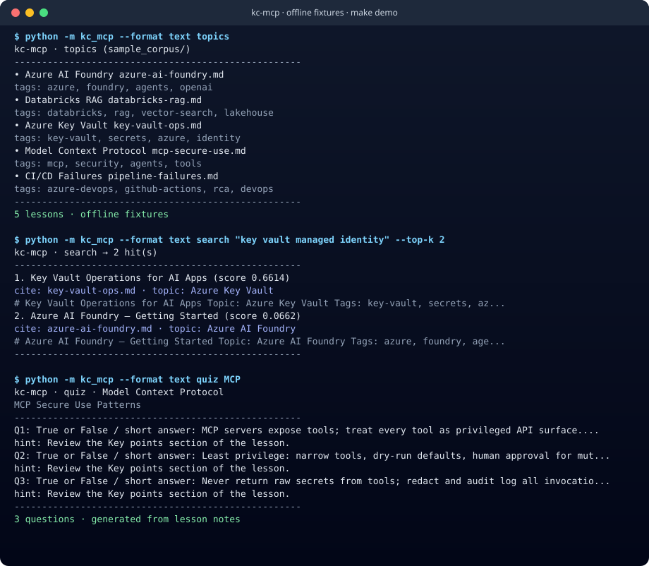
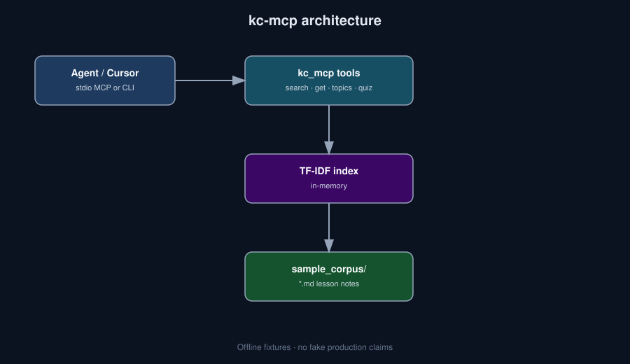

# kc-mcp


**Offline Knowledge Center tools for coding agents — search, cite, and quiz over lesson notes (MCP-shaped).**

> Who it's for: Azure AI SAs, platform engineers, and educators who want agents to cite **their** teaching content.

## 30-second demo



```bash
python -m venv .venv && source .venv/bin/activate
pip install -e .
python -m kc_mcp --format text topics
python -m kc_mcp --format text search "key vault managed identity" --top-k 2
python -m kc_mcp --format text quiz MCP
# or CI-equivalent:
make demo
```

Screenshot-friendly `--format text` (above) or default JSON. Regenerate the SVG: `make demo-assets`. Full Loom script + LinkedIn caption: [`docs/DEMO.md`](./docs/DEMO.md).

## Why this exists

Solution Architects teach constantly (reels, labs, ADRs). Agents forget that context unless it is a tool. `kc-mcp` turns a local teaching corpus into MCP-style tools so Cursor / Claude / custom agents can **search with citations**, pull clip notes, list topics, and generate offline quizzes — no vector DB bill, no cloud round-trip for the happy path.

## Install

```bash
python -m venv .venv && source .venv/bin/activate
pip install -e .
# optional MCP SDK transport:
pip install -e ".[mcp]"
```

Or with pipx (once published to PyPI): `pipx install kc-mcp` — until then use editable install from this repo.

## What it is NOT

- Not a production vector database or hosted RAG platform
- Not connected to Instagram, YouTube, or Azure by default
- Not embedding-based (MVP uses keyword / TF-IDF over Markdown)
- No fabricated download / star / production-usage claims — fixtures only

## Architecture



## Roadmap

- [ ] Optional embedding backend behind the same tool schemas
- [ ] Ingest real reel transcripts into `sample_corpus/`
- [ ] Richer MCP resources (per-lesson URI)

## Contributing

See [CONTRIBUTING.md](./CONTRIBUTING.md). Be kind — [CODE_OF_CONDUCT.md](./CODE_OF_CONDUCT.md). Security reports: [SECURITY.md](./SECURITY.md).

## MCP / Cursor plug-in

Install the optional MCP extra, then point Cursor (or any MCP host) at the stdio server:

```bash
pip install -e ".[mcp]"
```

Example `~/.cursor/mcp.json` entry:

```json
{
  "mcpServers": {
    "kc-mcp": {
      "command": "python",
      "args": ["-m", "kc_mcp.mcp_server"],
      "cwd": "/absolute/path/to/kc-mcp"
    }
  }
}
```

See [`docs/cursor-mcp.example.json`](./docs/cursor-mcp.example.json).

## License

MIT
